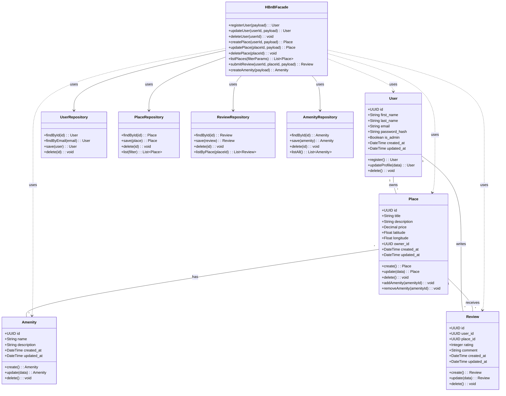

# HBnB Evolution — Part 1: Technical Documentation

**Purpose:**
This document provides a comprehensive technical blueprint for the HBnB Evolution application (Part 1). It includes a high-level package diagram (three-layer architecture using the Facade pattern), a detailed class diagram for the Business Logic layer, and sequence diagrams for four representative API calls. The document explains design decisions, component responsibilities, and interaction flows to guide implementation.

---

## Table of Contents

1. Introduction
2. High-Level Architecture (Package Diagram)
3. Business Logic Layer — Class Diagram
4. Sequence Diagrams (API Interaction Flows)

   * User Registration
   * Place Creation
   * Review Submission
   * Fetching a List of Places
5. Explanatory Notes and Design Rationale
6. Implementation Recommendations
7. Appendix: Mermaid diagrams and usage notes

---

## 1. Introduction

HBnB Evolution is a simplified AirBnB-like application intended to provide core features for user management, place listing, reviews, and amenities. The aim of this Part 1 documentation is to define the application's architecture and behavior precisely enough to support development in later parts.

This document focuses on:

* A 3-layer architecture (Presentation, Business Logic, Persistence).
* Using the Facade design pattern to decouple the Presentation layer from internal business complexity.
* Clear UML-style diagrams (expressed in Mermaid.js) to capture structure and sequences.

---

## 2. High-Level Architecture (Package Diagram)

**Goal:** Show the three main layers and the communication pathways between them. The Presentation layer communicates with the Business Logic layer through a single Facade interface (HBnBFacade). The Business Logic layer interacts with the Persistence layer via repository interfaces.

```mermaid
%% HBnB High-Level Package Diagram
classDiagram
direction TB

package "Presentation Layer" {
    class API {
        <<Interface>>
        +registerUser()
        +updateUser()
        +createPlace()
        +listPlaces()
        +submitReview()
        +createAmenity()
    }
}

package "Business Logic Layer" {
    class Models {
        +User
        +Place
        +Review
        +Amenity
        +HBnBFacade
    }
}

package "Persistence Layer" {
    class Repositories {
        +UserRepository
        +PlaceRepository
        +ReviewRepository
        +AmenityRepository
        +DatabaseConnection
    }
}

API --> HBnBFacade : uses / calls
HBnBFacade --> Repositories : database operations
```

**Notes:**

* `API` represents controllers/endpoints and service entry points.
* `HBnBFacade` aggregates business use-cases and orchestrates calls to models and repositories.
* Repositories encapsulate data access logic (ORM/queries).

---

## 3. Business Logic Layer — Class Diagram

**Goal:** Define the internal structure, attributes, methods, and relationships between the core domain entities: User, Place, Review, Amenity, and the HBnBFacade.

Key constraints to model:

* Each entity uses a UUID4 as `id`.
* Each entity records `created_at` and `updated_at` timestamps.
* Places belong to a User (owner).
* Places can have multiple Amenities (many-to-many relationship).
* Reviews link a User to a Place, with `rating` and `comment`.



**Notes on relationships & multiplicity:**

* A user can own multiple places (1..*).
* A place can have many amenities and an amenity can belong to many places (many-to-many). Implement via a join table (PlaceAmenity) in persistence layer.
* A user can write multiple reviews; a place can have multiple reviews.

---

## 4. Sequence Diagrams (API Interaction Flows)

**Goal:** For each use case, show step-by-step how a request flows from Presentation → Business Logic → Persistence and back.

### 4.1 User Registration


**Notes:**

* API hashes the password before sending to facade or the facade handles hashing as part of `registerUser` (design choice). Prefer hashing in Business Logic for security centralization.
* Facade validates unique email, creates user entity, and calls repository to persist.

---

### 4.2 Place Creation


**Notes:**

* The Facade enforces that the `userId` creating the place exists and is authorized.
* Amenity handling: facade may either accept existing amenity IDs or accept names and create missing amenities.

---

### 4.3 Review Submission


**Notes:**

* Facade ensures that the user has permission to review (e.g., was a guest). If no such enforcement, at minimum check user exists and place exists.

---

### 4.4 Fetching a List of Places


**Notes:**

* Pagination, filtering and sorting should be implemented at repository level for efficiency.
* Geospatial queries (radius) are implemented via DB-level features or geo-indexes.

---

## 5. Explanatory Notes and Design Rationale

### Facade Pattern

* Centralizes business operations for a simpler Presentation API interface.
* Reduces coupling: controllers call only the facade rather than many domain services/repositories.
* Facilitates transactional boundaries: facade methods can open/commit/rollback transactions across repositories.

### Repositories & Persistence

* Repositories abstract DB specifics (ORM/SQL). They should provide efficient query interfaces for filtering, pagination and geospatial queries.
* Use a join table `place_amenities (place_id, amenity_id)` to model many-to-many relation.

### Security Considerations

* Password hashing must be performed before persistence using a strong hash (bcrypt/argon2).
* Sensitive fields (password) must not be returned by API responses.
* Input validation must happen in Business Logic layer (facade) to ensure uniform rules.

### Timestamps & IDs

* Use UUID v4 for `id` fields to avoid sequential leakage and ease distribution.
* Record `created_at` and `updated_at` (UTC) on all entities.

---

## 6. Implementation Recommendations

* **Languages & frameworks:** Any modern backend stack (Python + FastAPI/Django, Node.js + Express/NestJS, Java + Spring Boot).
* **Database:** PostgreSQL recommended (supports geo-extensions like PostGIS). Alternative: MySQL, SQLite for tests.
* **ORM:** SQLAlchemy (Python), TypeORM/Prisma (Node.js), Hibernate (Java).
* **Testing:** Unit tests for facade methods and integration tests for repository operations.
* **Logging & monitoring:** Log important facade actions and repository errors with structured logging.
* **CI/CD:** Automate tests and static checks; include schema migrations (Flyway, Alembic, Liquibase).

---

## 7. Appendix: Mermaid diagrams and usage notes

* Use Mermaid.js in Markdown documents or READMEs to version-control diagrams.
* Keep diagrams updated as implementation evolves.
* When converting to a PDF, render the Mermaid diagrams to images for compatibility.

---

### Deliverables included

* High-Level Package Diagram (Mermaid)
* Business Logic Class Diagram (Mermaid)
* Four Sequence Diagrams (Mermaid) for the listed API calls
* Explanatory notes, design rationale, and implementation recommendations

*Document created for the holbertonschool-hbnb repository, directory: part1*

